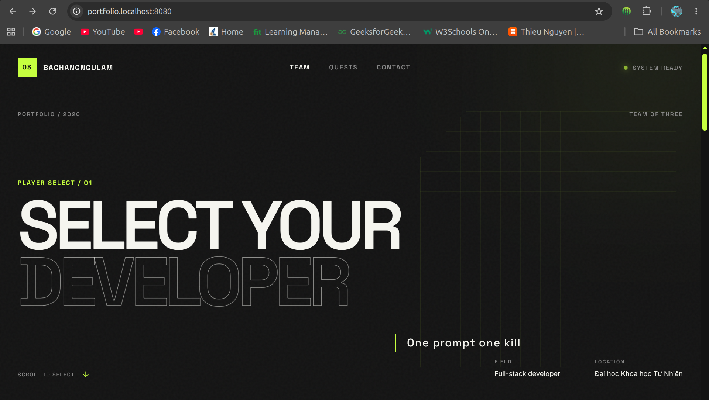
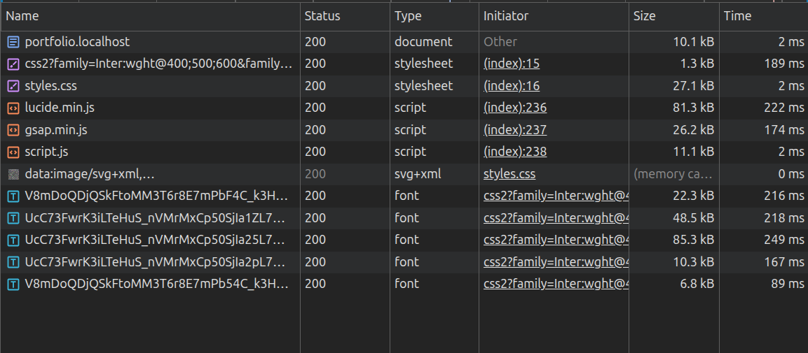
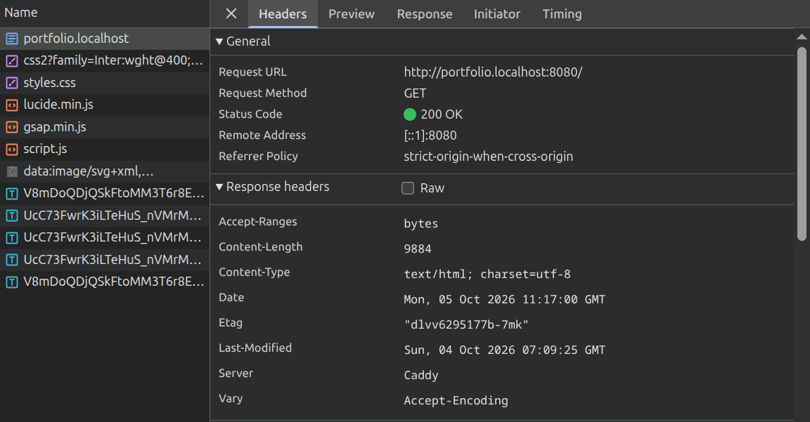
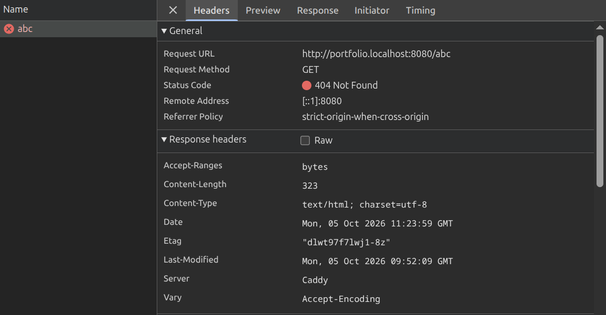
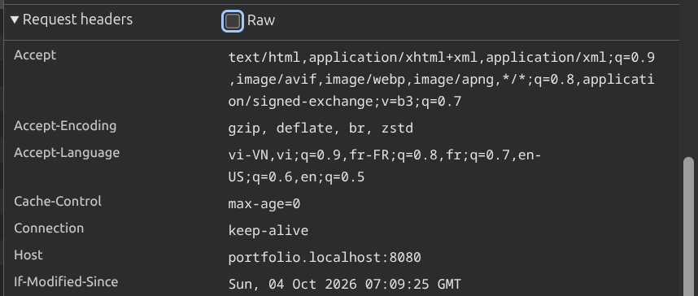
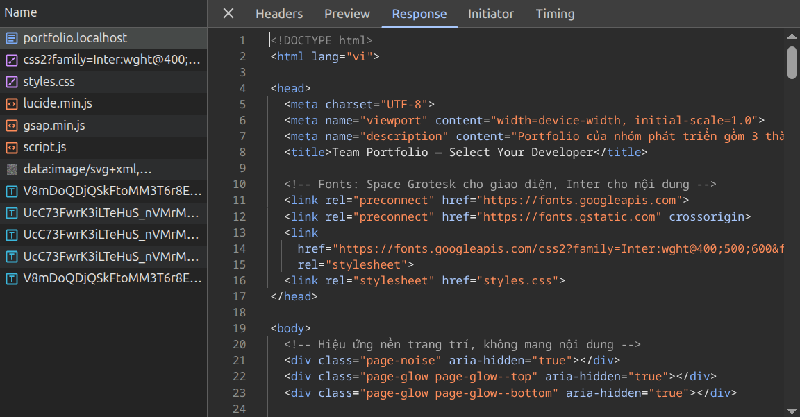

# Group Portfolio

# 1. Decisions

## Quyết định 0:

Đối tượng người xem: Giảng viên và các sinh viên cùng lớp

## Quyết định 1:

Chọn Theme là dạng hiện đại. Từng thành viên là từng card nhân vật. Ấn vào hiện thông tin cụ thể.

## Quyết định 2:

Chọn tech stack:

- html + css + js -> Vì lí do đơn giản, hoàn thành nhanh trong thời gian
- **Icon:** Lucide Icon -> Nhẹ
- **Animation:** gsap -> gồm nhiều animation ấn tượng

## Quyết định 3:

Các thông tin cần đưa vào:

1. Giới thiệu chung về nhóm ở main page:

- Tên nhóm
- Slogan
- Lĩnh vực nhóm theo đuổi

2. Thông tin từng cá nhân:

- Họ tên
- Vai trò
- Kĩ năng
- Mối quan tâm

# 1. Local Hosting

## 1.1. Lựa chọn caddy hay nginx

Sau khi nhờ AI so sánh giữa dùng nginx và caddy thì nhóm quyết định chọn caddy vì lí do đây chỉ là 1 portfolio đơn giản nên dùng caddy set up sẽ ít phức tạp (chỉ cần vài dòng ngắn trong Caddyfile) và tiết kiệm thời gian hơn so với dùng nginx.

Ngoài ra, khi cần mở rộng sang HTTPS, Caddy tự động khởi tạo và cài đặt Local CA vào hệ thống, không cần cài đặt thêm công cụ tạo cert thủ công như mkcert hay tự ký chứng chỉ phức tạp như trên Nginx.

## 1.2. Hướng dẫn run và stop server

**Điều kiện tiên quyết**

- Đã cài đặt Caddy trên máy tính.

- Mở Terminal và di chuyển vào đúng thư mục chứa Caddyfile

**Lệnh run:**

```
caddy run
```

**Lệnh stop:**

- Nếu trong terminal đang chạy `caddy run` : `Ctrl + C`
- Nếu ở terminal khác:
  ```
  caddy stop
  ```

## 1.3. Evidence

### Truy cập site bằng URL qua HTTP: http://portfolio.localhost:8080



### Network Evidence

**Request thành công:**




**Request lỗi:**
Truy cập: http://portfolio.localhost:8080/abc



## 1.4. Giải thích 1 cặp Request - Response




#### **Phía Reqest:**

**Request URL:** `http://portfolio.localhost:8080/ `

**Method:** `GET`

- **Ý nghĩa:** Trình duyệt gửi lệnh yêu cầu nhận dữ liệu trang gốc (/) mà không sửa đổi dữ liệu trên máy chủ.

**Host:** `portfolio.localhost:8080`: Cho Caddy biết request đang gọi tới virtual host nào để khớp đúng khối cấu hình trong Caddyfile.

**Accept:** `text/html,...`: Trình duyệt khai báo với server rằng nó mong muốn nhận lại nội dung hiển thị dưới định dạng văn bản web HTML.

#### **Phía Response:**

**Status Code:** `200 OK`: Server xác nhận đã tìm thấy tài nguyên hợp lệ và xử lý thành công.

**Server:** `Caddy`: Khẳng định chính phần mềm Caddy đang xử lý và phản hồi request này.

**Content-Type:** `text/html; charset=utf-8`: Hướng dẫn trình duyệt hiểu phần nội dung trả về là mã HTML và mã hóa ký tự UTF-8 để hiển thị đúng tiếng Việt.

**Content-Length:** `9884`: Báo trước kích thước chính xác (tính theo byte) của file HTML để trình duyệt biết dung lượng cần tải.

**Body:** Toàn bộ nội dung văn bản mã nguồn của file index.html được đính kèm ở phần thân phản hồi.

